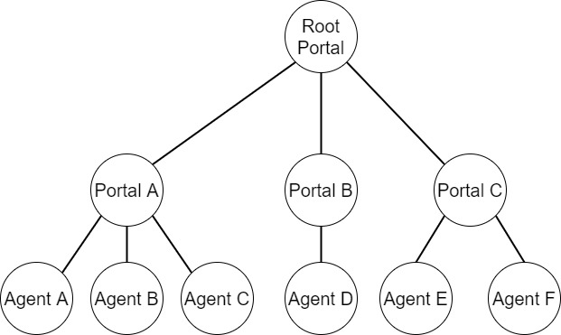
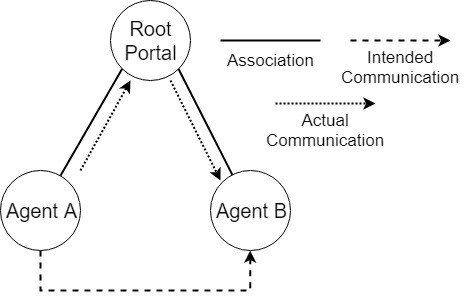

# Meta Agents 

 

An interconnected, multi-threaded, multi-agent system for the transferral of messages throughout a system/network.

# About 
## Interconnection 
Meta-agents are connected via a tree-like structure; where a normal MetaAgent knows about itself and its direct parent Portal. Each Portal knows about its parent and all of its children MetaAgents; due to the fact that Portals extend from MetaAgent, each Portal may contain others as children, and so forth, allowing for endless expansion.
#### Diagram:

## Messages 
Each message is handled by the MetaAgent that receives it; if the messge cannot or should be handled by this agent, it forwards the message upwards to its parent Portal who determines the route to find the the correct agent via its Routing table.
#### Diagram:

## Routing 
Routing is handled via specialised SystemMessages  which are strictly for internal use and allow for the creation and removal of agents when received by a MetaAgent.

# How to use: 
## From IDE 
Run the individual main classes for the implementation you would like to see.

## From JAR 
Run the JAR file without any arguments then read the help message given.
